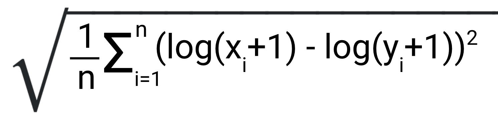

# Метрики в машинном обучении

Здесь я попытался представить почти полный перечень метрик используемый в машинном обучении. 
Метрики я описывал так, что бы было понятно как их применять, когда их применять, как их  
знаения интерпретировать.
* RMSLE - Root Mean Squared Logarithmic Error 
Среднеквадратичная логарифмическая ошибка

 
x - фактическое значение, y - предсказанное значение
Результат - неотрицательное значение с плавающей запятой (лучшее значение - 0.0)
Лучшей считается модель у которой RMSLE меньше.